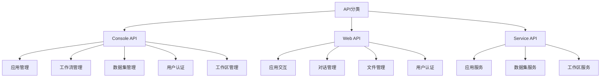

# Dify 项目 API 分析

本文档详细分析了 Dify 项目中的所有 API 接口，包括其功能、用途和对应的前端页面。

## 1. API 概述

Dify 项目包含三类主要的 API 接口：

1. **Console API** - 控制台管理 API，用于应用配置、监控和管理
2. **Web API** - Web 应用 API，用于文件上传、聊天交互和应用管理
3. **Service API** - 服务 API，用于应用程序服务

## 2. Console API

Console API 是管理后台使用的 API，提供完整的应用管理功能。

### 2.1 应用管理相关 API

#### 工作流管理 API

##### 获取工作流草稿
- **URL**: `/apps/{app_id}/workflows/draft`
- **方法**: GET
- **功能**: 获取应用的工作流草稿
- **代码位置**: [api/controllers/console/app/workflow.py](../api/controllers/console/app/workflow.py)
- **前端使用**: 
  - [web/service/workflow.ts](../web/service/workflow.ts) 中的 [fetchWorkflowDraft](../web/service/workflow.ts#L11-L13) 函数
  - 工作流编辑页面，用于加载当前工作流草稿

##### 同步工作流草稿
- **URL**: `/apps/{app_id}/workflows/draft`
- **方法**: POST
- **功能**: 同步工作流草稿配置
- **代码位置**: [api/controllers/console/app/workflow.py](../api/controllers/console/app/workflow.py)
- **前端使用**:
  - [web/service/workflow.ts](../web/service/workflow.ts) 中的 [syncWorkflowDraft](../web/service/workflow.ts#L15-L19) 函数
  - 工作流编辑页面，用于保存工作流配置

##### 运行工作流草稿
- **URL**: `/apps/{app_id}/workflows/draft/run`
- **方法**: POST
- **功能**: 运行工作流草稿
- **代码位置**: [api/controllers/console/app/workflow.py](../api/controllers/console/app/workflow.py)
- **前端使用**:
  - [web/service/workflow.ts](../web/service/workflow.ts) 中的相关函数
  - 工作流调试页面，用于测试工作流执行

##### 运行工作流节点
- **URL**: `/apps/{app_id}/workflows/draft/nodes/{node_id}/run`
- **方法**: POST
- **功能**: 运行工作流中的单个节点
- **代码位置**: [api/controllers/console/app/workflow.py](../api/controllers/console/app/workflow.py)
- **前端使用**:
  - 工作流节点调试功能
  - 单个节点测试页面

##### 获取已发布的工作流
- **URL**: `/apps/{app_id}/workflows/publish`
- **方法**: GET
- **功能**: 获取已发布的工作流
- **代码位置**: [api/controllers/console/app/workflow.py](../api/controllers/console/app/workflow.py)
- **前端使用**:
  - 工作流版本管理页面
  - 工作流发布历史查看

##### 发布工作流
- **URL**: `/apps/{app_id}/workflows/publish`
- **方法**: POST
- **功能**: 发布工作流草稿
- **代码位置**: [api/controllers/console/app/workflow.py](../api/controllers/console/app/workflow.py)
- **前端使用**:
  - 工作流发布页面
  - 工作流管理界面的发布按钮

##### 获取默认工作流块配置
- **URL**: `/apps/{app_id}/workflows/default-workflow-block-configs`
- **方法**: GET
- **功能**: 获取工作流默认块配置
- **代码位置**: [api/controllers/console/app/workflow.py](../api/controllers/console/app/workflow.py)
- **前端使用**:
  - 工作流节点添加面板
  - 节点配置初始化

##### 获取特定类型默认块配置
- **URL**: `/apps/{app_id}/workflows/default-workflow-block-configs/{block_type}`
- **方法**: GET
- **功能**: 获取特定类型工作流块的默认配置
- **代码位置**: [api/controllers/console/app/workflow.py](../api/controllers/console/app/workflow.py)
- **前端使用**:
  - 添加新节点时的配置初始化
  - 节点类型选择面板

##### 转换应用为工作流模式
- **URL**: `/apps/{app_id}/convert-to-workflow`
- **方法**: POST
- **功能**: 将现有应用转换为工作流模式
- **代码位置**: [api/controllers/console/app/workflow.py](../api/controllers/console/app/workflow.py)
- **前端使用**:
  - 应用类型转换功能
  - 工作流创建向导

##### 获取所有已发布工作流
- **URL**: `/apps/{app_id}/workflows`
- **方法**: GET
- **功能**: 获取应用的所有已发布工作流
- **代码位置**: [api/controllers/console/app/workflow.py](../api/controllers/console/app/workflow.py)
- **前端使用**:
  - 工作流版本历史页面
  - 工作流管理面板

##### 更新工作流
- **URL**: `/apps/{app_id}/workflows/{workflow_id}`
- **方法**: PATCH
- **功能**: 更新工作流属性
- **代码位置**: [api/controllers/console/app/workflow.py](../api/controllers/console/app/workflow.py)
- **前端使用**:
  - 工作流属性编辑功能
  - 工作流版本备注编辑

##### 删除工作流
- **URL**: `/apps/{app_id}/workflows/{workflow_id}`
- **方法**: DELETE
- **功能**: 删除指定工作流
- **代码位置**: [api/controllers/console/app/workflow.py](../api/controllers/console/app/workflow.py)
- **前端使用**:
  - 工作流版本删除功能
  - 工作流管理面板

##### 获取节点最后运行结果
- **URL**: `/apps/{app_id}/workflows/draft/nodes/{node_id}/last-run`
- **方法**: GET
- **功能**: 获取节点最后运行结果
- **代码位置**: [api/controllers/console/app/workflow.py](../api/controllers/console/app/workflow.py)
- **前端使用**:
  - 节点调试面板
  - 节点执行历史查看

#### 工作流运行日志 API

##### 获取工作流运行列表
- **URL**: `/apps/{app_id}/workflow-runs`
- **方法**: GET
- **功能**: 获取工作流运行列表
- **代码位置**: [api/controllers/console/app/workflow_run.py](../api/controllers/console/app/workflow_run.py)
- **前端使用**:
  - 工作流运行历史页面
  - 调试记录查看面板

##### 获取工作流运行统计
- **URL**: `/apps/{app_id}/workflow-runs/count`
- **方法**: GET
- **功能**: 获取工作流运行统计信息
- **代码位置**: [api/controllers/console/app/workflow_run.py](../api/controllers/console/app/workflow_run.py)
- **前端使用**:
  - 工作流统计面板
  - 仪表板数据展示

##### 获取工作流运行详情
- **URL**: `/apps/{app_id}/workflow-runs/{run_id}`
- **方法**: GET
- **功能**: 获取工作流运行详情
- **代码位置**: [api/controllers/console/app/workflow_run.py](../api/controllers/console/app/workflow_run.py)
- **前端使用**:
  - 工作流运行详情页面
  - 调试会话详情查看

##### 获取工作流节点执行列表
- **URL**: `/apps/{app_id}/workflow-runs/{run_id}/node-executions`
- **方法**: GET
- **功能**: 获取工作流运行中节点执行列表
- **代码位置**: [api/controllers/console/app/workflow_run.py](../api/controllers/console/app/workflow_run.py)
- **前端使用**:
  - 工作流执行路径查看
  - 节点执行详情分析

#### 应用基础管理 API

##### 创建应用
- **URL**: `/apps`
- **方法**: POST
- **功能**: 创建新应用
- **代码位置**: [api/controllers/console/app/app.py](../api/controllers/console/app/app.py)
- **前端使用**:
  - 应用创建向导
  - 新建应用页面

##### 获取应用列表
- **URL**: `/apps`
- **方法**: GET
- **功能**: 获取应用列表
- **代码位置**: [api/controllers/console/app/app.py](../api/controllers/console/app/app.py)
- **前端使用**:
  - 应用仪表板
  - 应用管理页面

##### 获取应用详情
- **URL**: `/apps/{app_id}`
- **方法**: GET
- **功能**: 获取应用详情
- **代码位置**: [api/controllers/console/app/app.py](../api/controllers/console/app/app.py)
- **前端使用**:
  - 应用详情页面
  - 应用配置查看

##### 更新应用
- **URL**: `/apps/{app_id}`
- **方法**: POST
- **功能**: 更新应用信息
- **代码位置**: [api/controllers/console/app/app.py](../api/controllers/console/app/app.py)
- **前端使用**:
  - 应用设置页面
  - 应用信息编辑

##### 删除应用
- **URL**: `/apps/{app_id}`
- **方法**: DELETE
- **功能**: 删除应用
- **代码位置**: [api/controllers/console/app/app.py](../api/controllers/console/app/app.py)
- **前端使用**:
  - 应用管理页面的删除功能
  - 应用清理操作

##### 复制应用
- **URL**: `/apps/{app_id}/copy`
- **方法**: POST
- **功能**: 复制现有应用
- **代码位置**: [api/controllers/console/app/app.py](../api/controllers/console/app/app.py)
- **前端使用**:
  - 应用复制功能
  - 模板应用创建

##### 导出应用
- **URL**: `/apps/{app_id}/export`
- **方法**: GET
- **功能**: 导出应用配置
- **代码位置**: [api/controllers/console/app/app.py](../api/controllers/console/app/app.py)
- **前端使用**:
  - 应用导出功能
  - 应用备份操作

##### 导入应用
- **URL**: `/apps/import`
- **方法**: POST
- **功能**: 导入应用配置
- **代码位置**: [api/controllers/console/app/app.py](../api/controllers/console/app/app.py)
- **前端使用**:
  - 应用导入功能
  - 应用恢复操作

### 2.2 数据集管理相关 API

#### 数据集基础操作

##### 创建数据集
- **URL**: `/datasets`
- **方法**: POST
- **功能**: 创建新数据集
- **代码位置**: [api/controllers/console/datasets/datasets.py](../api/controllers/console/datasets/datasets.py)
- **前端使用**:
  - 数据集创建向导
  - 新建数据集页面

##### 获取数据集列表
- **URL**: `/datasets`
- **方法**: GET
- **功能**: 获取数据集列表
- **代码位置**: [api/controllers/console/datasets/datasets.py](../api/controllers/console/datasets/datasets.py)
- **前端使用**:
  - 数据集管理页面
  - 数据集列表展示

##### 获取数据集详情
- **URL**: `/datasets/{dataset_id}`
- **方法**: GET
- **功能**: 获取数据集详情
- **代码位置**: [api/controllers/console/datasets/datasets.py](../api/controllers/console/datasets/datasets.py)
- **前端使用**:
  - 数据集详情页面
  - 数据集配置查看

##### 更新数据集
- **URL**: `/datasets/{dataset_id}`
- **方法**: PATCH
- **功能**: 更新数据集信息
- **代码位置**: [api/controllers/console/datasets/datasets.py](../api/controllers/console/datasets/datasets.py)
- **前端使用**:
  - 数据集设置页面
  - 数据集信息编辑

##### 删除数据集
- **URL**: `/datasets/{dataset_id}`
- **方法**: DELETE
- **功能**: 删除数据集
- **代码位置**: [api/controllers/console/datasets/datasets.py](../api/controllers/console/datasets/datasets.py)
- **前端使用**:
  - 数据集管理页面的删除功能
  - 数据集清理操作

#### 文档管理

##### 添加文档到数据集
- **URL**: `/datasets/{dataset_id}/document/create_by/{document_type}`
- **方法**: POST
- **功能**: 添加文档到数据集
- **代码位置**: [api/controllers/console/datasets/datasets_document.py](../api/controllers/console/datasets/datasets_document.py)
- **前端使用**:
  - 文档上传页面
  - 数据集内容管理

##### 获取数据集文档列表
- **URL**: `/datasets/{dataset_id}/documents`
- **方法**: GET
- **功能**: 获取数据集中的文档列表
- **代码位置**: [api/controllers/console/datasets/datasets_document.py](../api/controllers/console/datasets/datasets_document.py)
- **前端使用**:
  - 文档管理页面
  - 数据集内容查看

##### 获取文档详情
- **URL**: `/datasets/{dataset_id}/documents/{document_id}`
- **方法**: GET
- **功能**: 获取文档详情
- **代码位置**: [api/controllers/console/datasets/datasets_document.py](../api/controllers/console/datasets/datasets_document.py)
- **前端使用**:
  - 文档详情页面
  - 文档内容查看

##### 更新文档
- **URL**: `/datasets/{dataset_id}/documents/{document_id}`
- **方法**: POST
- **功能**: 更新文档信息
- **代码位置**: [api/controllers/console/datasets/datasets_document.py](../api/controllers/console/datasets/datasets_document.py)
- **前端使用**:
  - 文档编辑功能
  - 文档信息更新

##### 删除文档
- **URL**: `/datasets/{dataset_id}/documents/{document_id}`
- **方法**: DELETE
- **功能**: 删除文档
- **代码位置**: [api/controllers/console/datasets/datasets_document.py](../api/controllers/console/datasets/datasets_document.py)
- **前端使用**:
  - 文档管理页面的删除功能
  - 文档清理操作

##### 批量删除文档
- **URL**: `/datasets/{dataset_id}/documents`
- **方法**: DELETE
- **功能**: 批量删除文档
- **代码位置**: [api/controllers/console/datasets/datasets_document.py](../api/controllers/console/datasets/datasets_document.py)
- **前端使用**:
  - 批量文档删除功能
  - 数据集清理操作

#### 段落管理

##### 获取文档段落列表
- **URL**: `/datasets/{dataset_id}/documents/{document_id}/segments`
- **方法**: GET
- **功能**: 获取文档中的段落列表
- **代码位置**: [api/controllers/console/datasets/datasets_segments.py](../api/controllers/console/datasets/datasets_segments.py)
- **前端使用**:
  - 段落管理页面
  - 文档内容查看

##### 创建段落
- **URL**: `/datasets/{dataset_id}/documents/{document_id}/segments`
- **方法**: POST
- **功能**: 创建新段落
- **代码位置**: [api/controllers/console/datasets/datasets_segments.py](../api/controllers/console/datasets/datasets_segments.py)
- **前端使用**:
  - 段落添加功能
  - 文档内容编辑

##### 获取段落详情
- **URL**: `/datasets/{dataset_id}/segments/{segment_id}`
- **方法**: GET
- **功能**: 获取段落详情
- **代码位置**: [api/controllers/console/datasets/datasets_segments.py](../api/controllers/console/datasets/datasets_segments.py)
- **前端使用**:
  - 段落详情页面
  - 段落内容查看

##### 更新段落
- **URL**: `/datasets/{dataset_id}/segments/{segment_id}`
- **方法**: PATCH
- **功能**: 更新段落信息
- **代码位置**: [api/controllers/console/datasets/datasets_segments.py](../api/controllers/console/datasets/datasets_segments.py)
- **前端使用**:
  - 段落编辑功能
  - 段落内容更新

##### 删除段落
- **URL**: `/datasets/{dataset_id}/segments/{segment_id}`
- **方法**: DELETE
- **功能**: 删除段落
- **代码位置**: [api/controllers/console/datasets/datasets_segments.py](../api/controllers/console/datasets/datasets_segments.py)
- **前端使用**:
  - 段落管理页面的删除功能
  - 段落清理操作

##### 批量处理段落
- **URL**: `/datasets/{dataset_id}/segments/{segment_id}/batch`
- **方法**: POST
- **功能**: 批量处理段落（启用/禁用）
- **代码位置**: [api/controllers/console/datasets/datasets_segments.py](../api/controllers/console/datasets/datasets_segments.py)
- **前端使用**:
  - 批量段落处理功能
  - 段落状态管理

### 2.3 用户认证和权限管理 API

#### 用户登录认证

##### 用户登录
- **URL**: `/login`
- **方法**: POST
- **功能**: 用户登录认证
- **代码位置**: [api/controllers/console/auth/login.py](../api/controllers/console/auth/login.py)
- **前端使用**:
  - 登录页面
  - 用户认证流程

##### 用户登出
- **URL**: `/logout`
- **方法**: POST
- **功能**: 用户登出
- **代码位置**: [api/controllers/console/auth/login.py](../api/controllers/console/auth/login.py)
- **前端使用**:
  - 用户菜单中的登出功能
  - 会话管理

##### 刷新访问令牌
- **URL**: `/refresh`
- **方法**: GET
- **功能**: 刷新访问令牌
- **代码位置**: [api/controllers/console/auth/login.py](../api/controllers/console/auth/login.py)
- **前端使用**:
  - 会话保持机制
  - 自动令牌刷新

#### OAuth 认证

##### OAuth 登录重定向
- **URL**: `/oauth/login`
- **方法**: GET
- **功能**: OAuth 登录重定向
- **代码位置**: [api/controllers/console/auth/oauth.py](../api/controllers/console/auth/oauth.py)
- **前端使用**:
  - 第三方登录按钮
  - OAuth 登录流程

##### OAuth 回调处理
- **URL**: `/oauth/callback`
- **方法**: GET
- **功能**: 处理 OAuth 回调
- **代码位置**: [api/controllers/console/auth/oauth.py](../api/controllers/console/auth/oauth.py)
- **前端使用**:
  - OAuth 认证回调页面
  - 登录结果处理

##### OAuth 绑定
- **URL**: `/oauth/bind`
- **方法**: GET/POST
- **功能**: 绑定 OAuth 账户
- **代码位置**: [api/controllers/console/auth/oauth.py](../api/controllers/console/auth/oauth.py)
- **前端使用**:
  - 账户绑定设置
  - 第三方账户管理

#### 邮箱注册

##### 邮箱注册
- **URL**: `/account/register`
- **方法**: POST
- **功能**: 邮箱注册新用户
- **代码位置**: [api/controllers/console/auth/email_register.py](../api/controllers/console/auth/email_register.py)
- **前端使用**:
  - 注册页面
  - 新用户注册流程

##### 验证注册邮箱
- **URL**: `/account/validate`
- **方法**: POST
- **功能**: 验证注册邮箱
- **代码位置**: [api/controllers/console/auth/email_register.py](../api/controllers/console/auth/email_register.py)
- **前端使用**:
  - 邮箱验证页面
  - 注册验证流程

#### 密码重置

##### 忘记密码
- **URL**: `/forgot-password`
- **方法**: POST
- **功能**: 发起密码重置流程
- **代码位置**: [api/controllers/console/auth/forgot_password.py](../api/controllers/console/auth/forgot_password.py)
- **前端使用**:
  - 忘记密码页面
  - 密码重置流程

##### 重置密码
- **URL**: `/reset-password`
- **方法**: POST
- **功能**: 重置用户密码
- **代码位置**: [api/controllers/console/auth/forgot_password.py](../api/controllers/console/auth/forgot_password.py)
- **前端使用**:
  - 密码重置页面
  - 密码更新操作

### 2.4 工作区管理 API

#### 工作区基础操作

##### 获取当前工作区
- **URL**: `/workspaces/current`
- **方法**: GET
- **功能**: 获取当前工作区信息
- **代码位置**: [api/controllers/console/workspace/workspace.py](../api/controllers/console/workspace/workspace.py)
- **前端使用**:
  - 工作区切换面板
  - 工作区信息显示

##### 切换工作区
- **URL**: `/workspaces/switch`
- **方法**: POST
- **功能**: 切换到指定工作区
- **代码位置**: [api/controllers/console/workspace/workspace.py](../api/controllers/console/workspace/workspace.py)
- **前端使用**:
  - 工作区切换功能
  - 多工作区管理

##### 获取工作区列表
- **URL**: `/workspaces`
- **方法**: GET
- **功能**: 获取工作区列表
- **代码位置**: [api/controllers/console/workspace/workspace.py](../api/controllers/console/workspace/workspace.py)
- **前端使用**:
  - 工作区管理页面
  - 工作区列表展示

#### 成员管理

##### 获取工作区成员
- **URL**: `/workspaces/{workspace_id}/members`
- **方法**: GET
- **功能**: 获取工作区成员列表
- **代码位置**: [api/controllers/console/workspace/members.py](../api/controllers/console/workspace/members.py)
- **前端使用**:
  - 成员管理页面
  - 团队成员查看

##### 邀请成员
- **URL**: `/workspaces/{workspace_id}/members`
- **方法**: POST
- **功能**: 邀请新成员加入工作区
- **代码位置**: [api/controllers/console/workspace/members.py](../api/controllers/console/workspace/members.py)
- **前端使用**:
  - 成员邀请功能
  - 团队协作管理

##### 更新成员角色
- **URL**: `/workspaces/{workspace_id}/members/{member_id}`
- **方法**: PUT
- **功能**: 更新成员角色
- **代码位置**: [api/controllers/console/workspace/members.py](../api/controllers/console/workspace/members.py)
- **前端使用**:
  - 成员权限管理
  - 角色分配功能

##### 删除成员
- **URL**: `/workspaces/{workspace_id}/members/{member_id}`
- **方法**: DELETE
- **功能**: 从工作区删除成员
- **代码位置**: [api/controllers/console/workspace/members.py](../api/controllers/console/workspace/members.py)
- **前端使用**:
  - 成员移除功能
  - 团队管理操作

#### 模型提供商管理

##### 获取模型提供商列表
- **URL**: `/workspaces/current/model-providers`
- **方法**: GET
- **功能**: 获取当前工作区可用的模型提供商列表
- **代码位置**: [api/controllers/console/workspace/model_providers.py](../api/controllers/console/workspace/model_providers.py)
- **前端使用**:
  - 模型提供商管理页面
  - 模型配置选择

##### 获取模型提供商凭据
- **URL**: `/workspaces/current/model-providers/{provider_name}/credentials`
- **方法**: GET
- **功能**: 获取模型提供商凭据信息
- **代码位置**: [api/controllers/console/workspace/model_providers.py](../api/controllers/console/workspace/model_providers.py)
- **前端使用**:
  - 模型凭据配置页面
  - API 密钥管理

##### 更新模型提供商凭据
- **URL**: `/workspaces/current/model-providers/{provider_name}/credentials`
- **方法**: POST
- **功能**: 更新模型提供商凭据
- **代码位置**: [api/controllers/console/workspace/model_providers.py](../api/controllers/console/workspace/model_providers.py)
- **前端使用**:
  - 模型凭据更新功能
  - API 密钥配置

#### 模型管理

##### 获取工作区模型列表
- **URL**: `/workspaces/current/models`
- **方法**: GET
- **功能**: 获取工作区模型列表
- **代码位置**: [api/controllers/console/workspace/models.py](../api/controllers/console/workspace/models.py)
- **前端使用**:
  - 模型管理页面
  - 模型选择面板

##### 添加模型
- **URL**: `/workspaces/current/models`
- **方法**: POST
- **功能**: 添加新模型到工作区
- **代码位置**: [api/controllers/console/workspace/models.py](../api/controllers/console/workspace/models.py)
- **前端使用**:
  - 模型添加功能
  - 自定义模型配置

##### 更新模型
- **URL**: `/workspaces/current/models/{model_id}`
- **方法**: POST
- **功能**: 更新工作区模型配置
- **代码位置**: [api/controllers/console/workspace/models.py](../api/controllers/console/workspace/models.py)
- **前端使用**:
  - 模型配置更新
  - 模型参数调整

##### 删除模型
- **URL**: `/workspaces/current/models/{model_id}`
- **方法**: DELETE
- **功能**: 从工作区删除模型
- **代码位置**: [api/controllers/console/workspace/models.py](../api/controllers/console/workspace/models.py)
- **前端使用**:
  - 模型删除功能
  - 模型管理操作

### 2.5 探索和推荐 API

#### 推荐应用

##### 获取推荐应用列表
- **URL**: `/explore/apps`
- **方法**: GET
- **功能**: 获取推荐应用列表
- **代码位置**: [api/controllers/console/explore/recommended_app.py](../api/controllers/console/explore/recommended_app.py)
- **前端使用**:
  - 应用市场页面
  - 推荐应用展示

##### 获取推荐应用详情
- **URL**: `/explore/apps/{app_id}`
- **方法**: GET
- **功能**: 获取推荐应用详情
- **代码位置**: [api/controllers/console/explore/recommended_app.py](../api/controllers/console/explore/recommended_app.py)
- **前端使用**:
  - 应用详情页面
  - 应用信息查看

##### 安装推荐应用
- **URL**: `/explore/apps/{app_id}/install`
- **方法**: POST
- **功能**: 安装推荐应用到当前工作区
- **代码位置**: [api/controllers/console/explore/recommended_app.py](../api/controllers/console/explore/recommended_app.py)
- **前端使用**:
  - 应用安装功能
  - 模板应用使用

#### 已安装应用

##### 获取已安装应用列表
- **URL**: `/installed-apps`
- **方法**: GET
- **功能**: 获取当前工作区已安装的应用列表
- **代码位置**: [api/controllers/console/explore/installed_app.py](../api/controllers/console/explore/installed_app.py)
- **前端使用**:
  - 已安装应用页面
  - 应用使用入口

##### 获取已安装应用详情
- **URL**: `/installed-apps/{app_id}`
- **方法**: GET
- **功能**: 获取已安装应用详情
- **代码位置**: [api/controllers/console/explore/installed_app.py](../api/controllers/console/explore/installed_app.py)
- **前端使用**:
  - 应用使用页面
  - 应用交互界面

##### 更新已安装应用
- **URL**: `/installed-apps/{app_id}`
- **方法**: POST
- **功能**: 更新已安装应用配置
- **代码位置**: [api/controllers/console/explore/installed_app.py](../api/controllers/console/explore/installed_app.py)
- **前端使用**:
  - 应用配置更新
  - 应用参数调整

## 3. Web API

Web API 是面向最终用户的 API，主要用于应用交互。

### 3.1 应用交互 API

#### 应用会话管理

##### 创建应用会话
- **URL**: `/apps/{app_id}/conversation`
- **方法**: POST
- **功能**: 为应用创建新会话
- **代码位置**: [api/controllers/web/conversation.py](../api/controllers/web/conversation.py)
- **前端使用**:
  - 聊天应用界面
  - 新对话创建

##### 获取应用会话列表
- **URL**: `/apps/{app_id}/conversations`
- **方法**: GET
- **功能**: 获取应用会话列表
- **代码位置**: [api/controllers/web/conversation.py](../api/controllers/web/conversation.py)
- **前端使用**:
  - 对话历史页面
  - 会话记录查看

##### 重命名会话
- **URL**: `/conversations/{conversation_id}/name`
- **方法**: POST
- **功能**: 重命名会话
- **代码位置**: [api/controllers/web/conversation.py](../api/controllers/web/conversation.py)
- **前端使用**:
  - 会话重命名功能
  - 对话管理操作

##### 删除会话
- **URL**: `/conversations/{conversation_id}`
- **方法**: DELETE
- **功能**: 删除会话
- **代码位置**: [api/controllers/web/conversation.py](../api/controllers/web/conversation.py)
- **前端使用**:
  - 会话删除功能
  - 对话清理操作

#### 消息管理

##### 发送消息
- **URL**: `/apps/{app_id}/chat-messages`
- **方法**: POST
- **功能**: 向应用发送聊天消息
- **代码位置**: [api/controllers/web/message.py](../api/controllers/web/message.py)
- **前端使用**:
  - 聊天界面消息发送
  - 应用交互功能

##### 获取消息列表
- **URL**: `/apps/{app_id}/chat-messages`
- **方法**: GET
- **功能**: 获取聊天消息列表
- **代码位置**: [api/controllers/web/message.py](../api/controllers/web/message.py)
- **前端使用**:
  - 聊天记录查看
  - 消息历史展示

##### 获取消息详情
- **URL**: `/apps/{app_id}/chat-messages/{message_id}`
- **方法**: GET
- **功能**: 获取聊天消息详情
- **代码位置**: [api/controllers/web/message.py](../api/controllers/web/message.py)
- **前端使用**:
  - 消息详情查看
  - 对话内容分析

##### 停止消息回复
- **URL**: `/apps/{app_id}/chat-messages/{message_id}/stop`
- **方法**: POST
- **功能**: 停止消息回复生成
- **代码位置**: [api/controllers/web/message.py](../api/controllers/web/message.py)
- **前端使用**:
  - 消息生成停止功能
  - 用户中断操作

#### 工作流交互

##### 运行工作流应用
- **URL**: `/apps/{app_id}/workflow-run`
- **方法**: POST
- **功能**: 运行工作流应用
- **代码位置**: [api/controllers/web/workflow.py](../api/controllers/web/workflow.py)
- **前端使用**:
  - 工作流应用界面
  - 工作流执行操作

##### 获取工作流运行状态
- **URL**: `/apps/{app_id}/workflow-run/{run_id}`
- **方法**: GET
- **功能**: 获取工作流运行状态
- **代码位置**: [api/controllers/web/workflow.py](../api/controllers/web/workflow.py)
- **前端使用**:
  - 工作流执行状态查看
  - 进度监控面板

## 4. Service API

Service API 是面向开发者和服务集成的 API。

### 4.1 应用服务 API

#### 应用管理

##### 创建应用
- **URL**: `/apps`
- **方法**: POST
- **功能**: 创建新应用
- **代码位置**: [api/controllers/service_api/app/app.py](../api/controllers/service_api/app/app.py)
- **前端使用**:
  - 第三方集成平台
  - 自动化部署工具

##### 获取应用列表
- **URL**: `/apps`
- **方法**: GET
- **功能**: 获取应用列表
- **代码位置**: [api/controllers/service_api/app/app.py](../api/controllers/service_api/app/app.py)
- **前端使用**:
  - 应用管理工具
  - 系统集成接口

##### 获取应用详情
- **URL**: `/apps/{app_id}`
- **方法**: GET
- **功能**: 获取应用详情
- **代码位置**: [api/controllers/service_api/app/app.py](../api/controllers/service_api/app/app.py)
- **前端使用**:
  - 应用信息查询
  - 系统监控工具

##### 更新应用
- **URL**: `/apps/{app_id}`
- **方法**: POST
- **功能**: 更新应用信息
- **代码位置**: [api/controllers/service_api/app/app.py](../api/controllers/service_api/app/app.py)
- **前端使用**:
  - 应用配置更新
  - 自动化管理工具

##### 删除应用
- **URL**: `/apps/{app_id}`
- **方法**: DELETE
- **功能**: 删除应用
- **代码位置**: [api/controllers/service_api/app/app.py](../api/controllers/service_api/app/app.py)
- **前端使用**:
  - 应用生命周期管理
  - 自动化清理工具

#### 对话服务

##### 创建对话
- **URL**: `/apps/{app_id}/conversations`
- **方法**: POST
- **功能**: 为应用创建新对话
- **代码位置**: [api/controllers/service_api/app/conversation.py](../api/controllers/service_api/app/conversation.py)
- **前端使用**:
  - 聊天机器人集成
  - 客服系统对接

##### 获取对话列表
- **URL**: `/apps/{app_id}/conversations`
- **方法**: GET
- **功能**: 获取应用对话列表
- **代码位置**: [api/controllers/service_api/app/conversation.py](../api/controllers/service_api/app/conversation.py)
- **前端使用**:
  - 对话记录查询
  - 数据分析工具

##### 发送消息
- **URL**: `/apps/{app_id}/messages`
- **方法**: POST
- **功能**: 向应用发送消息
- **代码位置**: [api/controllers/service_api/app/message.py](../api/controllers/service_api/app/message.py)
- **前端使用**:
  - 消息发送接口
  - 聊天应用集成

##### 获取消息列表
- **URL**: `/apps/{app_id}/messages`
- **方法**: GET
- **功能**: 获取消息列表
- **代码位置**: [api/controllers/service_api/app/message.py](../api/controllers/service_api/app/message.py)
- **前端使用**:
  - 消息历史查询
  - 对话数据分析

### 4.2 数据集服务 API

#### 数据集管理

##### 创建数据集
- **URL**: `/datasets`
- **方法**: POST
- **功能**: 创建新数据集
- **代码位置**: [api/controllers/service_api/dataset/dataset.py](../api/controllers/service_api/dataset/dataset.py)
- **前端使用**:
  - 数据集管理工具
  - 自动化数据处理

##### 获取数据集列表
- **URL**: `/datasets`
- **方法**: GET
- **功能**: 获取数据集列表
- **代码位置**: [api/controllers/service_api/dataset/dataset.py](../api/controllers/service_api/dataset/dataset.py)
- **前端使用**:
  - 数据集查询接口
  - 系统集成工具

##### 获取数据集详情
- **URL**: `/datasets/{dataset_id}`
- **方法**: GET
- **功能**: 获取数据集详情
- **代码位置**: [api/controllers/service_api/dataset/dataset.py](../api/controllers/service_api/dataset/dataset.py)
- **前端使用**:
  - 数据集信息查询
  - 数据分析工具

##### 更新数据集
- **URL**: `/datasets/{dataset_id}`
- **方法**: POST
- **功能**: 更新数据集信息
- **代码位置**: [api/controllers/service_api/dataset/dataset.py](../api/controllers/service_api/dataset/dataset.py)
- **前端使用**:
  - 数据集配置更新
  - 自动化管理工具

##### 删除数据集
- **URL**: `/datasets/{dataset_id}`
- **方法**: DELETE
- **功能**: 删除数据集
- **代码位置**: [api/controllers/service_api/dataset/dataset.py](../api/controllers/service_api/dataset/dataset.py)
- **前端使用**:
  - 数据集生命周期管理
  - 自动化清理工具

#### 文档管理

##### 创建文档
- **URL**: `/datasets/{dataset_id}/documents`
- **方法**: POST
- **功能**: 向数据集添加文档
- **代码位置**: [api/controllers/service_api/dataset/document.py](../api/controllers/service_api/dataset/document.py)
- **前端使用**:
  - 文档上传接口
  - 自动化数据处理

##### 获取文档列表
- **URL**: `/datasets/{dataset_id}/documents`
- **方法**: GET
- **功能**: 获取数据集文档列表
- **代码位置**: [api/controllers/service_api/dataset/document.py](../api/controllers/service_api/dataset/document.py)
- **前端使用**:
  - 文档查询接口
  - 内容管理系统集成

##### 删除文档
- **URL**: `/datasets/{dataset_id}/documents/{document_id}`
- **方法**: DELETE
- **功能**: 删除数据集中的文档
- **代码位置**: [api/controllers/service_api/dataset/document.py](../api/controllers/service_api/dataset/document.py)
- **前端使用**:
  - 文档清理接口
  - 自动化内容管理

## 5. 总结

Dify 项目提供了三类 API 接口，分别服务于不同的使用场景：

1. **Console API** - 面向管理员和开发者，提供完整的系统管理功能
2. **Web API** - 面向最终用户，提供应用交互功能
3. **Service API** - 面向系统集成和开发者，提供标准化的服务接口

这些 API 接口覆盖了从应用创建、配置、运行到监控的完整生命周期，支撑了 Dify 平台的核心功能。
