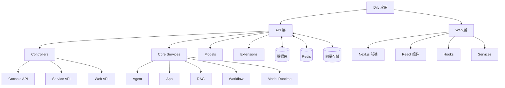
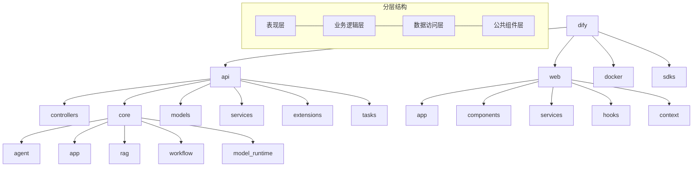
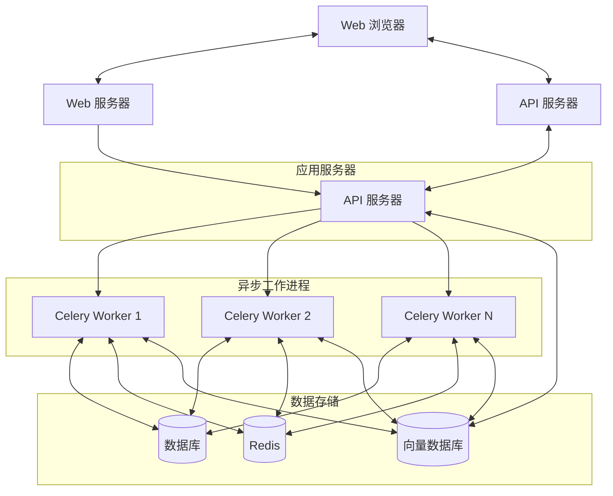
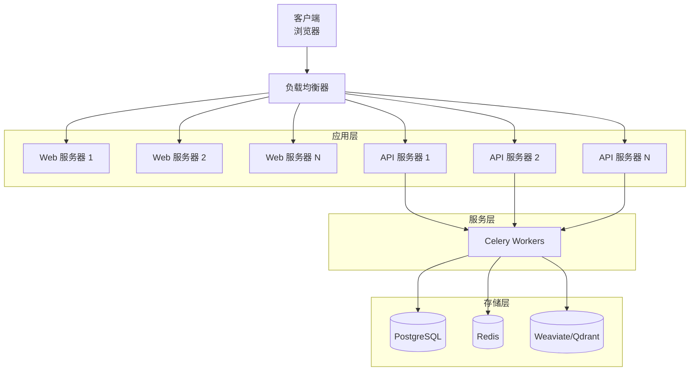
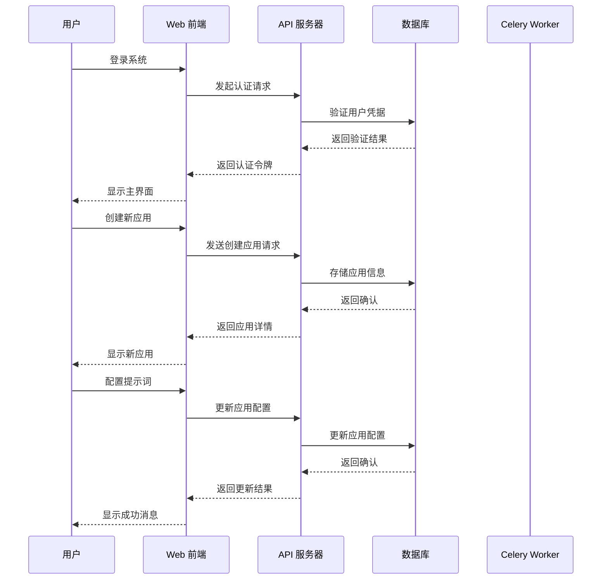
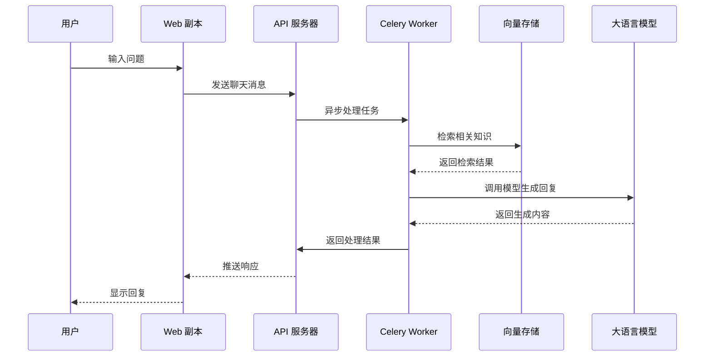

# Dify 项目架构文档

## 1. 逻辑视图

### 1.1 组件结构

### 1.2 核心模块说明

- **Agent**: 实现智能体(Agent)功能，包括工具调用、决策制定等
- **App**: 应用管理模块，处理不同类型的应用(聊天应用、工作流应用等)
- **RAG**: 检索增强生成(Retrieval-Augmented Generation)相关功能
- **Workflow**: 工作流引擎，实现可视化编排和执行
- **Model Runtime**: 模型运行时，统一接口访问各种大语言模型

## 2. 开发视图

## 3. 进程视图

## 4. 物理视图

## 5. 场景视图

### 5.1 用户创建聊天应用流程

### 5.2 用户运行聊天应用流程

## 总结

Dify 采用前后端分离的架构设计，后端基于 Flask 框架构建，前端使用 Next.js 框架。系统通过模块化设计实现了良好的可扩展性和可维护性，同时利用 Celery 实现异步任务处理，提高了系统的响应能力。整体架构支持水平扩展，能够满足不同规模的部署需求。
