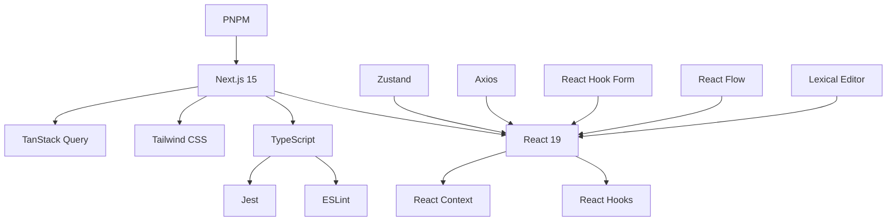
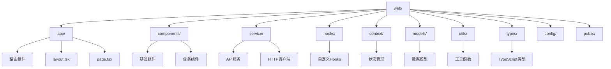
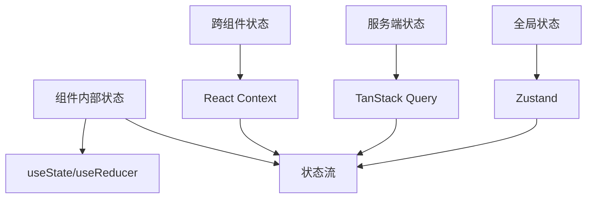
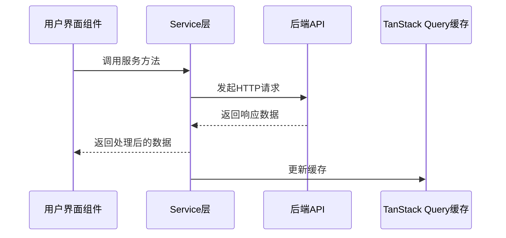
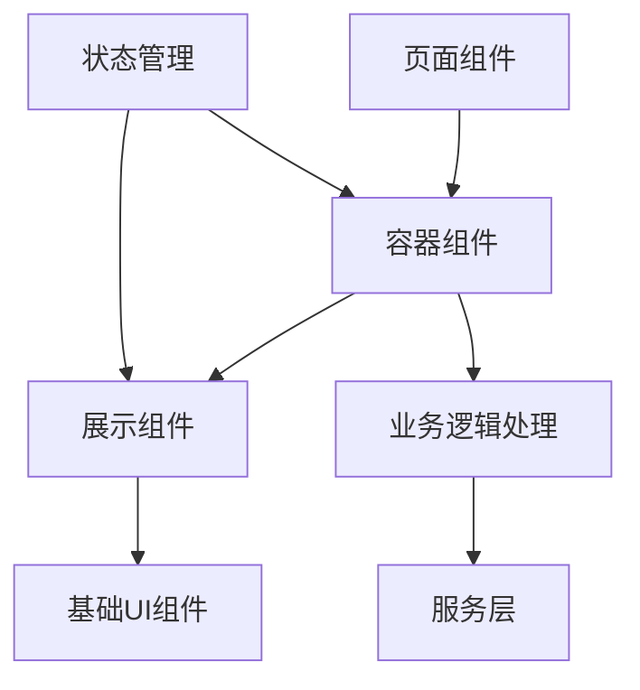

# Dify 前端架构分析

本文档详细分析了 Dify 项目的前端架构，包括技术栈、目录结构、核心概念和数据流等方面。

## 1. 技术栈

Dify 的前端主要基于以下技术构建：

### 1.1 核心框架和库

- **Next.js 15**: React 框架，提供服务端渲染、静态生成、路由等功能
- **React 19**: JavaScript UI 库，用于构建用户界面
- **TypeScript**: JavaScript 的超集，提供类型安全
- **Tailwind CSS**: 实用优先的 CSS 框架，用于样式设计
- **TanStack Query**: 服务端状态管理库，用于数据获取、缓存和更新
- **Zustand**: 轻量级状态管理库
- **React Hook Form**: 表单处理库
- **React Flow**: 构建节点图和工作流的库
- **Lexical**: Facebook 的可扩展文本编辑器框架

### 1.2 开发工具

- **PNPM**: 包管理器
- **ESLint**: 代码质量检查工具
- **Jest**: JavaScript 测试框架
- **Storybook**: UI 组件开发环境

## 2. 目录结构

### 2.1 主要目录说明

- **app/**: Next.js App Router 目录，包含应用的所有路由和页面
  - **(commonLayout)/**: 通用布局组件
  - **(shareLayout)/**: 分享页面布局
  - **components/**: 页面级组件
  - **layout.tsx**: 根布局文件
  - **page.tsx**: 根页面文件

- **app/components/**: 可复用的 UI 组件
  - **base/**: 基础 UI 组件（按钮、输入框等）
  - **app/**: 应用相关组件
  - **apps/**: 应用列表相关组件
  - **workflow/**: 工作流相关组件
  - **header/**: 页面头部组件

- **service/**: API 服务层，封装所有后端接口调用
  - **base.ts**: 基础 HTTP 客户端
  - **apps.ts**: 应用相关 API
  - **datasets.ts**: 数据集相关 API

- **hooks/**: 自定义 React Hooks
  - **use-breakpoints.ts**: 响应式断点处理
  - **use-document-title.ts**: 文档标题管理
  - **use-i18n.ts**: 国际化处理

- **context/**: React Context 状态管理
  - **app-context.tsx**: 应用级状态管理
  - **query-client.tsx**: TanStack Query 客户端配置
  - **workspace-context.tsx**: 工作区状态管理

- **models/**: TypeScript 数据模型定义
  - **app.ts**: 应用数据模型
  - **datasets.ts**: 数据集数据模型
  - **debug.ts**: 调试相关数据模型

- **utils/**: 工具函数
  - **classnames.ts**: CSS 类名处理
  - **format.ts**: 数据格式化
  - **local-storage.ts**: 本地存储操作

- **types/**: 全局 TypeScript 类型定义
  - **feature.ts**: 功能相关类型
  - **app.ts**: 应用相关类型

## 3. 核心架构概念

### 3.1 状态管理

Dify 前端采用了多种状态管理方案：

1. **组件内部状态**: 使用 React 的 useState 和 useReducer
2. **跨组件状态**: 使用 React Context API
3. **服务端状态**: 使用 TanStack Query 管理 API 数据
4. **全局状态**: 使用 Zustand 管理复杂全局状态

### 3.2 数据流

### 3.3 国际化

Dify 支持多语言国际化，使用 i18next 库实现：

- **i18n-config/**: 国际化配置和翻译文件
- **app/components/i18n.tsx**: 国际化组件封装
- **hooks/use-i18n.ts**: 国际化 Hook

### 3.4 路由系统

使用 Next.js App Router 实现：

- 基于文件系统的路由
- 动态路由支持
- 嵌套路由和布局组件
- 服务端渲染和静态生成

## 4. 关键特性

### 4.1 响应式设计

使用 Tailwind CSS 实现响应式设计，适配不同屏幕尺寸：

- 移动端优化
- 平板适配
- 桌面端布局

### 4.2 主题系统

使用 next-themes 实现深色/浅色主题切换：

- 系统主题自动检测
- 手动主题切换
- 主题持久化存储

### 4.3 性能优化

- 代码分割和懒加载
- 图片优化和懒加载
- 数据缓存和预取
- 服务工作者和 PWA 支持

## 5. 组件架构

### 5.1 组件分类

1. **页面组件**: 对应具体路由，组合容器组件
2. **容器组件**: 处理业务逻辑，连接状态管理和服务层
3. **展示组件**: 纯展示功能，接收 props 并渲染 UI
4. **基础组件**: 原子级 UI 组件，如按钮、输入框等

### 5.2 组件通信

- **Props**: 父组件向子组件传递数据
- **Callbacks**: 子组件向父组件传递事件
- **Context**: 跨层级组件状态共享
- **Refs**: 直接访问 DOM 或组件实例

## 6. 开发实践

### 6.1 代码规范

- 使用 TypeScript 提供类型安全
- ESLint 保证代码质量
- Prettier 统一代码风格
- Commitlint 规范提交信息

### 6.2 测试策略

- 单元测试使用 Jest
- 组件测试使用 React Testing Library
- E2E 测试使用 Cypress

### 6.3 构建和部署

- 使用 Next.js 的构建系统
- 支持静态导出和服务端渲染
- Docker 镜像构建支持
- CI/CD 集成

## 总结

Dify 前端架构采用现代化的 React 技术栈，基于 Next.js 框架构建，具有清晰的目录结构和分层架构。通过合理的状态管理、数据流设计和组件化方案，保证了代码的可维护性和可扩展性。同时，项目还注重性能优化、响应式设计和国际化支持，为用户提供良好的使用体验。